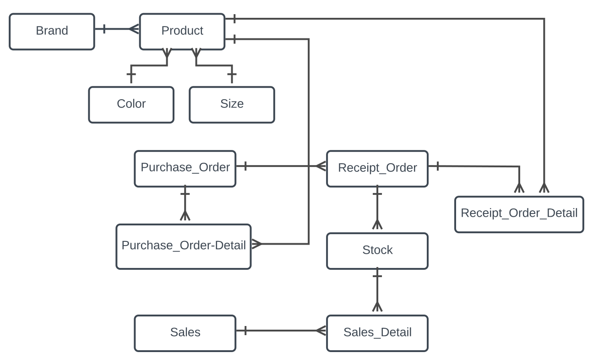

# Toko Ijah

This application is a REST API to handling inventory for a small business

## Story

Ijah usually notes her inventory activity in a spreadsheet document.
Ijah wants to replace her spreadsheet by creating an application.

### Requirements

Must have features :

1. Catatan Jumlah Barang
   * Stores actual stock of products
2. Catatan Barang Masuk
   * Catatan Barang Masuk
3. Catatan Barang Keluar
   * To store product that will be stored into the inventory.
4. Laporan Nilai Barang
   * Shows a report for ijah to help her analyze and make decision. This report is related to total inventory value of Toko Ijah.
5. Laporan Penjualan
   * Shows a report for ijah to help her analyze and make decision. This report is related to omzet / selling / profit.
6. Export data report in CSV format

Optional features:

1. import data from CSV/spreadsheet (data migration)
2. CMS UI for inventory management

### Assumptions

1. The **SKU** is a combination of product attributes such as store code `SSI-`,brand code `DXXXXX-`, size code `MM-`, and color code `RED`
2. **ID pesanan** is combination of sales prefix code `ID-`, date `YYYYMMDD-`, and running number `531154`
3. There are processes such as Purchase order, Receive order, and Sales.
4. The **Nomer Kwitansi** is not mandatory when receiving purchase order.
5. In Stock product is available after the Receipt order process.
6. Purchase order can be completed with one to several receipt order.
7. Out stock will be counted from sales

## Design

Base on requirements, the structure will be look like this.



## Stack

This application is use golang and sqlite.

### Run the application

```bash
make run
```
